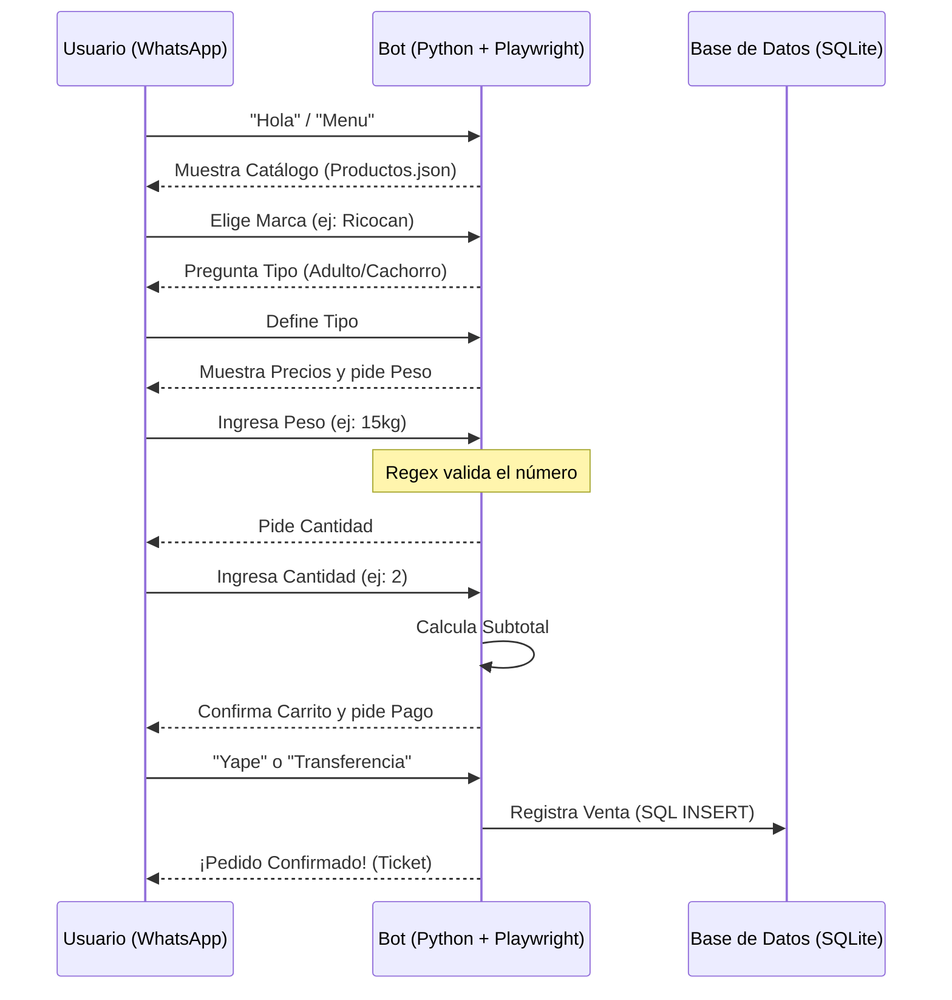

# 🐶 WhatsApp Bot - Sistema de Ventas (ArgosMarket)

Bot automatizado de e-commerce para WhatsApp Web desarrollado en Python. Permite gestionar pedidos completos, validación de pagos, carrito de compras y exportación de reportes a Excel.

## 🚀 Características Principales

- **🤖 Automatización Inteligente:** Uso de `Playwright` para interactuar con WhatsApp Web en tiempo real.
- **🛒 Carrito de Compras:** Soporte para múltiples productos y cantidades en un solo pedido.
- **🧠 Detección con Regex:** Extracción inteligente de cantidades y pesos (Ej: "quiero 2 sacos" -> detecta `2`).
- **🛡️ Validaciones:**
  - Control de stock y marcas desde JSON.
  - Validación estricta de métodos de pago (Yape/Transferencia).
  - Flujo de salida prioritario ("Salir").
- **📊 Reportes:** Exportación de ventas a Excel con formato automático.
- **💾 Persistencia:** Base de datos SQLite local.

## 🛠️ Tecnologías Usadas

- **Python 3.10+**
- **Playwright** (Automatización de navegador)
- **Pandas** & **Openpyxl** (Reportes de datos)
- **SQLite** (Base de datos)

## 📂 Estructura del Proyecto

```text
├── src/
│   ├── pages/            # Page Object Model (POM)
│   ├── bot_logic.py      # Cerebro del bot (Lógica de ventas)
│   ├── config.py         # Configuraciones generales
│   ├── database.py       # Conexión y consultas SQL
│   ├── logger_config.py  # Configuración de logs
│   └── productos.json    # Catálogo de precios y stock
├── exportar_excel.py     # Script para generar reportes Excel
├── main.py               # Punto de entrada (Ejecutable)
├── ventas_argos.db       # Base de datos (Se crea automáticamente)
├── requirements.txt      # Lista de dependencias
└── Dockerfile            # Configuración para Docker
```


## 🔄 Flujo de Funcionamiento

El bot sigue una máquina de estados finitos para guiar al usuario a través del proceso de compra
:


## ⚙️ Instalación y Uso

1. **Clonar el repositorio:**
   ```bash
   git clone [https://github.com/MariadelCarmenPM/whatsapp-bot-mascotas.git](https://github.com/MariadelCarmenPM/whatsapp-bot-mascotas.git)
   cd whatsapp-bot-mascotas
   ```

2. **Instalar dependencias:**
   ```bash
   pip install -r requirements.txt
   playwright install chromium
   ```

3. **Ejecutar el Bot:**
   ```bash
   python main.py
   ```
   *Se abrirá el navegador para escanear el código QR.*

4. **Generar Reporte Excel:**
   ```bash
   python exportar_excel.py
   ```

---
Desarrollado con ❤️ para ArgosMarket.